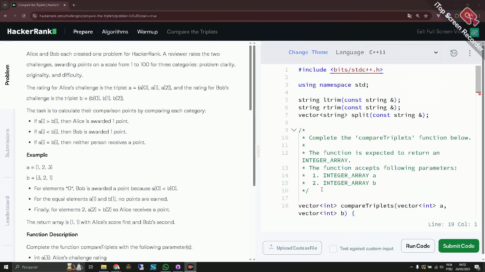

# TRAVOICE - Tradutor com Voz



## Estrutura do Projeto

```
travoice/
├── .gitattributes
├── .gitignore
├── LICENSE
├── README.md
├── config.json
├── doc
    └── demo.gif
├── icon.ico
├── install.md
├── launcher.py
├── requirements.txt
├── run.py
└── src
    ├── config
        ├── init.py
        ├── languages.py
        └── settings.py
    ├── core
        ├── hotkey_manager.py
        ├── init.py
        ├── translator.py
        └── tts_engine.py
    ├── init.py
    ├── main.py
    └── utils
        ├── clipboard.py
        ├── init.py
        └── logger.py
```

## Funcionalidades Principais

### ✨ Novas Features
- 🌐 **Seleção de idiomas**: Escolha idioma de origem e destino
- ⚙️ **Configuração persistente**: Configurações salvas em arquivo JSON
- 🎛️ **Menu interativo**: Interface de configuração via console
- 📁 **Estrutura modular**: Código organizado em módulos
- 🔧 **Hotkeys personalizáveis**: Teclas de atalho configuráveis
- 📊 **Sistema de logs**: Melhor rastreamento de erros
- 🎯 **Detecção automática**: Auto-detecção de idioma opcional

### 🎮 Comandos Disponíveis
- `Ctrl+C` → Copiar texto selecionado
- `Alt+T` → Traduzir e falar
- `Alt+I` → Parar fala
- `Alt+V` → Testar voz
- `Alt+M` → Mostrar menu
- `Alt+C` → Configurar idiomas
- `Ctrl+Q` → Sair do programa

### 🌍 Idiomas Suportados
O sistema suporta todos os idiomas do Google Translate, incluindo:
- Português (pt)
- Inglês (en)
- Espanhol (es)
- Francês (fr)
- Alemão (de)
- Italiano (it)
- Japonês (ja)
- Chinês (zh)
- E muitos outros...

3. **Configurar idiomas**:
   - Pressione `Alt+C` para abrir o menu de configuração
   - Escolha os idiomas de origem e destino
   - As configurações são salvas automaticamente

4. **Usar o tradutor**:
   - Selecione um texto em qualquer aplicativo
   - Pressione `Ctrl+C` para copiar
   - Pressione `Alt+T` para traduzir e ouvir

## Melhorias Implementadas

### 🏗️ Arquitetura
- **Separação de responsabilidades**: Cada módulo tem uma função específica
- **Configuração centralizada**: Todas as configurações em um local
- **Tratamento de erros robusto**: Melhor handling de exceções
- **Threading otimizado**: Performance melhorada para TTS

### 🔧 Funcionalidades
- **Configuração dinâmica**: Altere idiomas sem reiniciar
- **Preview de texto**: Visualize o texto antes da tradução
- **Persistência**: Configurações mantidas entre sessões
- **Logs detalhados**: Melhor debugging e monitoramento
